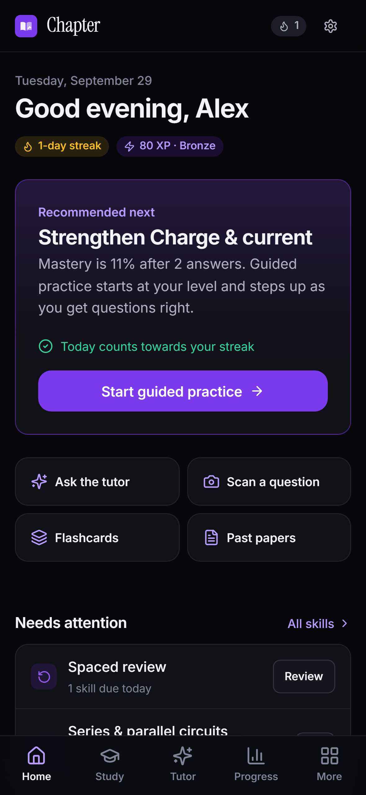
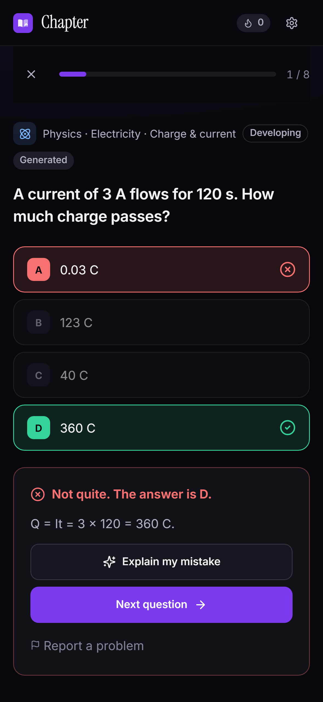
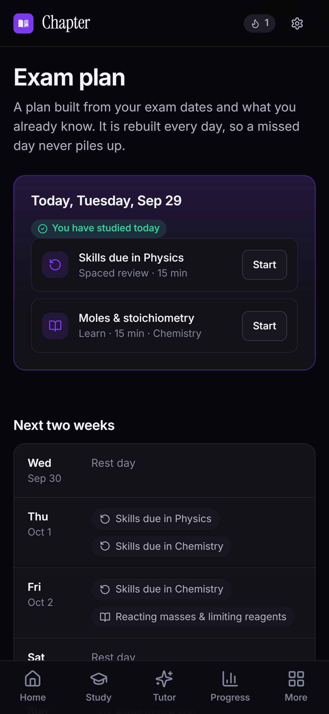
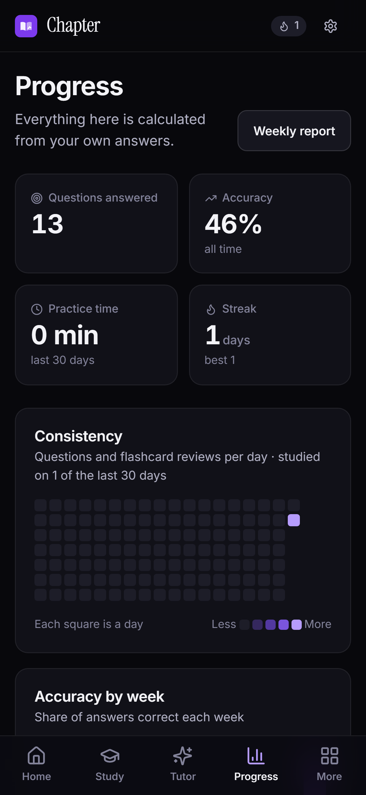

# Chapter

**Chapter knows what you don't understand yet, and teaches it until it sticks.**

An adaptive study app for IGCSE and Digital SAT students. It finds your weak skills, recognises the misconception behind each wrong answer, explains that idea, serves the right next question, and brings the skill back days later to check you really learned it. Free to use.

- **Try it:** https://chapter-sepia-omega.vercel.app (free; sign up with any email, no confirmation needed)

<p>
  
  
  
  
</p>

### For judges

1. Open the link, **Create account** (any email; no confirmation), pick IGCSE and a subject or two.
2. Practise: Study → Physics → Electricity → Guided practice on a skill. Pick a wrong answer to see the misconception feedback, then **Explain my mistake** (live AI tutor).
3. **Chapter Plus (RevenueCat):** Settings → Usage & Plus → **Get Plus** → **Test valid purchase**. It runs on RevenueCat's Test Store, so nothing is charged. The server confirms the purchase with RevenueCat, the Plus badge appears and the AI allowances triple.

## What makes it different

| | |
| --- | --- |
| **Skill-level mastery** | Every topic is split into skills. Mastery is a difficulty-weighted rating computed on the server, capped by evidence, so a few lucky answers never show as "mastered". |
| **Misconception detection** | Wrong options are linked to curated misconceptions ("multiplies voltage by resistance"). Chapter names the mistake, tracks it, and marks it resolved once you avoid the trap twice. |
| **Guided practice** | Two probe questions find your level; two unaided correct answers step you up; a mistake brings a short concept card and a different, easier question. |
| **Spaced review** | Skills return after 1, 3, 7, 14, 30 and 60 days, as fresh questions. |
| **AI tutor that teaches** | Three hint levels that never give the answer, "check my work" with a clear verdict, explain-my-mistake using the detected misconception, study plans and photo scanning. |
| **Exam plan** | Built from exam dates and weak skills and rebuilt daily, so a missed day never piles up. |
| **Honest content** | Every question has recorded provenance. AI-generated questions are solved independently by a second model before publishing. Past papers link to the official publishers rather than being copied. |
| **Review reminders** | Opt-in web push through **OneSignal**: at most one a day, at the student's chosen hour in their time zone, only when skills are due and they haven't studied yet. The notification only says how many skills are due. |
| **Parents** | A student can share progress with a parent, who never sees tutor chats, notes or flashcards. |
| **Chapter Plus** | Learning is free for everyone. An optional subscription through the **RevenueCat Web SDK** triples the AI allowances; access is verified on the server by a RevenueCat REST check and kept current by RevenueCat webhooks. See [docs/REVENUECAT_SETUP.md](docs/REVENUECAT_SETUP.md). |

## How it works

```
React 19 + TypeScript (Vite, PWA)  ──►  Supabase: Postgres with row-level security, Auth, Storage
                                        │  submit_attempt(): the server judges every answer and
                                        │  updates mastery, spaced review and misconceptions
                                        └► Edge Functions (Deno) ──► AI provider: Groq, OpenRouter or Anthropic (routed by task)
```

Details: [architecture](docs/ARCHITECTURE.md), [database and learning model](docs/DATABASE.md), [AI](docs/AI.md), [content pipeline](docs/CONTENT_PIPELINE.md), [security](docs/SECURITY.md).

## Deploy your own

1. Create a Supabase project and apply `supabase/migrations/001`–`022` (`supabase db push`).
2. Deploy the Edge Functions and set one AI provider key (Groq's free tier works) (see [docs/DEPLOYMENT.md](docs/DEPLOYMENT.md)).
3. Deploy the front end to **Vercel** (`vercel.json`), **Netlify** (`netlify.toml`) or any static host (`public/_redirects`, `public/_headers`) with `VITE_SUPABASE_URL` and `VITE_SUPABASE_ANON_KEY`, plus optionally `VITE_REVENUECAT_API_KEY` (Chapter Plus) and `VITE_AI_PROVIDER` (named in the privacy policy).

## Quick start

```bash
npm install
cp .env.example .env.local     # add your Supabase URL + anon key
npm run dev                    # http://localhost:5173
```

The database must have migrations `001`–`022` applied and the Edge Functions deployed for sign-in, practice and the tutor to work. See **[docs/DEPLOYMENT.md](docs/DEPLOYMENT.md)**.

## Scripts

| Command | What it does |
| --- | --- |
| `npm run dev` | Development server |
| `npm run build` | Type-check and production build to `dist/` |
| `npm run typecheck` | App, tooling, tests and Edge Functions (strict) |
| `npm run lint` | ESLint, including accessibility rules |
| `npm test` | Unit and component tests (Vitest) |
| `npm run test:db` | Runs every migration on real Postgres (PGlite) and tests RLS, grants, triggers and RPCs |
| `npm run test:e2e` | Browser tests of the production build against a mocked Supabase, on desktop and mobile. Run `npx playwright install chromium` once first |
| `npm run check` | Everything above except e2e, plus the content seed check |
| `npm run content:build` | Regenerates `017`/`018` seeds from `src/content` (skills, misconceptions, bank, templates, official links) |
| `npm run links:check` | Runs the official-link checker (`-- --local` checks the seed list directly) |
| `npm run icons` | Regenerates PWA icons, the social image and the 1024 px store icon |
| `npx playwright test --config playwright.live.config.ts` | Live smoke, AI and Chapter Plus purchase tests against a deployed site (`LIVE_URL`); each creates and deletes its own account |
| `node scripts/make-demo-video.mjs` | Builds the captioned demo video from a `playwright.demo.config.ts` recording |
| `npm run resources:import -- --links links.json` | Adds official links to the resources directory (admin; hosting files needs explicit licence flags) |
| `node scripts/generate-catalog-sql.mjs` | Regenerates `010_catalog_seed.sql` after editing `src/content/catalog.ts` |

## Project layout

```
src/
  app/            router, providers, error screens
  components/     design-system components (ui/), layout, charts, markdown
  content/        catalogue, skills, misconceptions, procedural templates, practice engine,
                  guided loop, official links; bank/ is the seed source (not shipped)
  data/           React Query hooks and Supabase access; offline answer outbox
  features/       one folder per area: auth, onboarding, home, study, tutor, papers, plan,
                  notes, flashcards, progress, reports, goals, leagues, settings, parent, admin
  lib/            pure logic: mastery, streaks, goals, reports, plan, recommendations, dates,
                  errors, telemetry, theme
  styles/         design tokens, base, components, layout, features
supabase/
  migrations/     001–022 (apply in order)
  functions/      ai-tutor, ai-generate, delete-account, link-checker, revenuecat-webhook,
                  revenuecat-sync, push-reminders, _shared/ (AI providers, prompts, question pipeline)
  tests/          database test harness + security tests
tests/
  unit/           Vitest
  e2e/            Playwright + mock backend
  live/           tests against the deployed site (real accounts, deleted afterwards)
  demo/, store/   demo video and store screenshot capture
submission/       1024 px icon and 1179 × 2556 screenshots
docs/             deployment, architecture, security, AI, database, content, operations
```

## Documentation

- [Deployment](docs/DEPLOYMENT.md) and the [production checklist](docs/PRODUCTION_CHECKLIST.md)
- [Architecture](docs/ARCHITECTURE.md), [database](docs/DATABASE.md) (including rollback) and [security](docs/SECURITY.md)
- [AI](docs/AI.md): providers, model routing, cost tracking, tutor modes
- [Chapter Plus with RevenueCat](docs/REVENUECAT_SETUP.md)
- [Content pipeline](docs/CONTENT_PIPELINE.md) and [content & provenance policy](docs/CONTENT_POLICY.md)
- [Operations](docs/OPERATIONS.md): admin routine, scheduled jobs, observability, incidents

Chapter is an independent study tool and is not affiliated with Cambridge International or the College Board.

## License

[MIT](LICENSE) © 2026 Whitespace Studio
